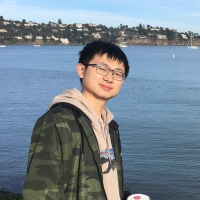

# **Ming Shi**

## About me

### I am a Post-Doctoral Scholar of the AI-EDGE Institute and Department of Electrical and Computer Engineering at The Ohio State University, Columbus, OH, USA. I received my Ph.D. degree from Purdue University, West Lafayette, IN, USA, in 2022.

### Research Interests:
#### Online learning, reinforcement learning and bandit learning, with applications in Edge AI and 6G+ networks.
#### Online convex optimization, with applications in networking, cloud computing and smart grid.
#### Regret analysis and competitive analysis for online algorithms.

# Research
## Publications

### Journal Papers
1. **Ming Shi**, Xiaojun Lin and Sonia Fahmy, “[Competitive Online Convex Optimization With Switching Costs and Ramp Constraints](https://par.nsf.gov/servlets/purl/10300527),” in IEEE/ACM Transactions on Networking, vol. 29, no. 2, pp. 876-889, April 2021, DOI: 10.1109/TNET.2021.3053910.
2. **Ming Shi**, Xiaojun Lin and Lei Jiao, “Combining Regularization With Look-Ahead for Competitive Online Convex Optimization,” manuscript in preparation.

### Conference Papers
1. **Ming Shi**, Xiaojun Lin, and Lei Jiao, "[Power-of-2-Arms for Bandit Learning with Switching Costs](https://ix.cs.uoregon.edu/~jiao/publications/mobihoc22.pdf)," in 23rd International Symposium on Theory, Algorithmic Foundations, and Protocol Design for Mobile Networks and Mobile Computing (ACM MobiHoc), Seoul, South Korea, October 2022. **(Acceptance rate: 19.8%.)**
2. **Ming Shi**, Xiaojun Lin and Lei Jiao, “[Combining Regularization with Look-Ahead for Competitive Online Convex Optimization](https://ix.cs.uoregon.edu/~jiao/publications/infocom21b.pdf),” in IEEE Conference on Computer Communications (INFOCOM), virtual conference, May 2021. **(Acceptance rate: 19.9%.)**
3. **Ming Shi**, Xiaojun Lin, Sonia Fahmy, and DongHoon Shin, “[Competitive Online Convex Optimization with Switching Costs and Ramp Constraints](https://www.cs.purdue.edu/homes/fahmy/papers/infocom2018.pdf),” in IEEE Conference on Computer Communications (INFOCOM), Honolulu, Hawaii, USA, April 2018. **(Acceptance rate: 19.2%.)**

### Technical Reports
1. **Ming Shi**, Xiaojun Lin, and Lei Jiao, "[Power-of-2-Arms for Bandit Learning with Switching Costs](https://engineering.purdue.edu/~linx/)," October 2022.
2. **Ming Shi**, Xiaojun Lin and Lei Jiao, “[Combining Regularization with Look-Ahead for Competitive Online Convex Optimization](https://engineering.purdue.edu/~linx/paper/infocom21-rla-tech.pdf),” May 2021.
3. **Ming Shi**, Xiaojun Lin and Sonia Fahmy, “[Competitive Online Convex Optimization with Switching Costs and Ramp Constraints](https://engineering.purdue.edu/~linx/paper/infocom18-oco.pdf),” April 2021.

## Invited Talks and Presentations
1. “Power-of-2-Arms for Bandit Learning with Switching Costs,” at Rigorous Systems Research Group (RSRG) meeting, The California Institute of Technology (Caltech), May 2022.
2. “Combining Regularization with Look-Ahead for Competitive Online Convex Optimization,” at IEEE Conference on Computer Communications (INFOCOM), virtual conference, May 2021.
3. “On the Value of Look-Ahead in Competitive Online Convex Optimization,” at ACM SIGMETRICS / IFIP Performance Joint International Conference, Phoenix, Arizona, USA, June 2019.
4. “Competitive Online Convex Optimization with Switching Costs and Ramp Constraints,” at IEEE Conference on Computer Communications (INFOCOM), Honolulu, Hawaii, USA, April 2018.

# Teaching
## Teaching Assistant: [ECE547: Introduction to Computer Communication Networks](https://engineering.purdue.edu/~ee547/), School of Electrical and Computer Engineering, Purdue University, Fall 2016.
